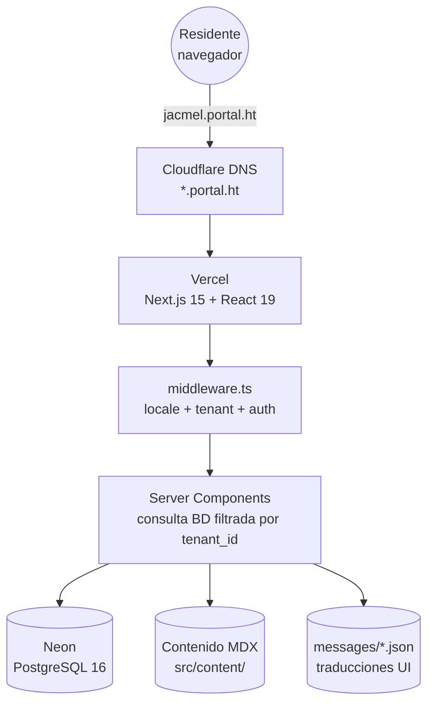
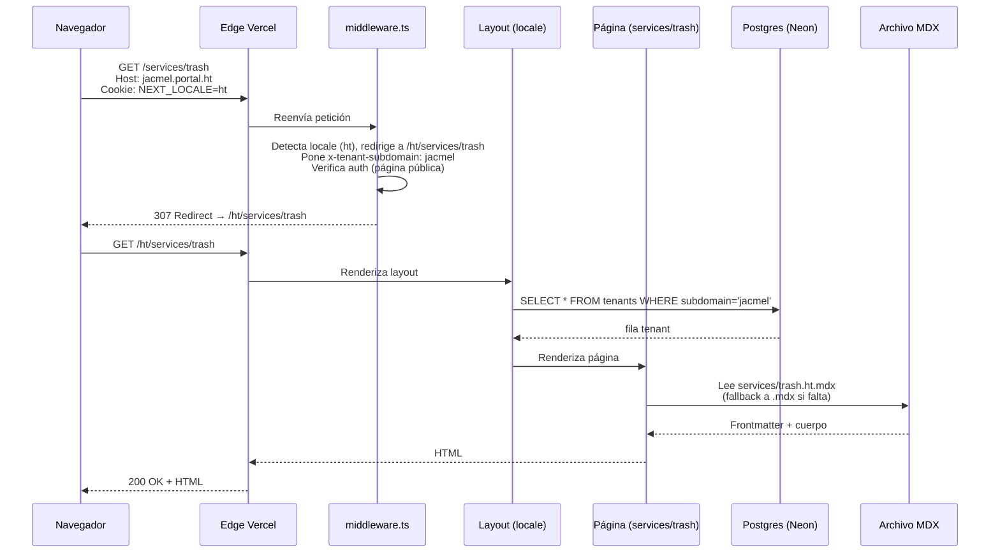
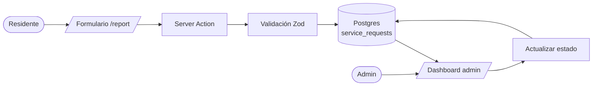
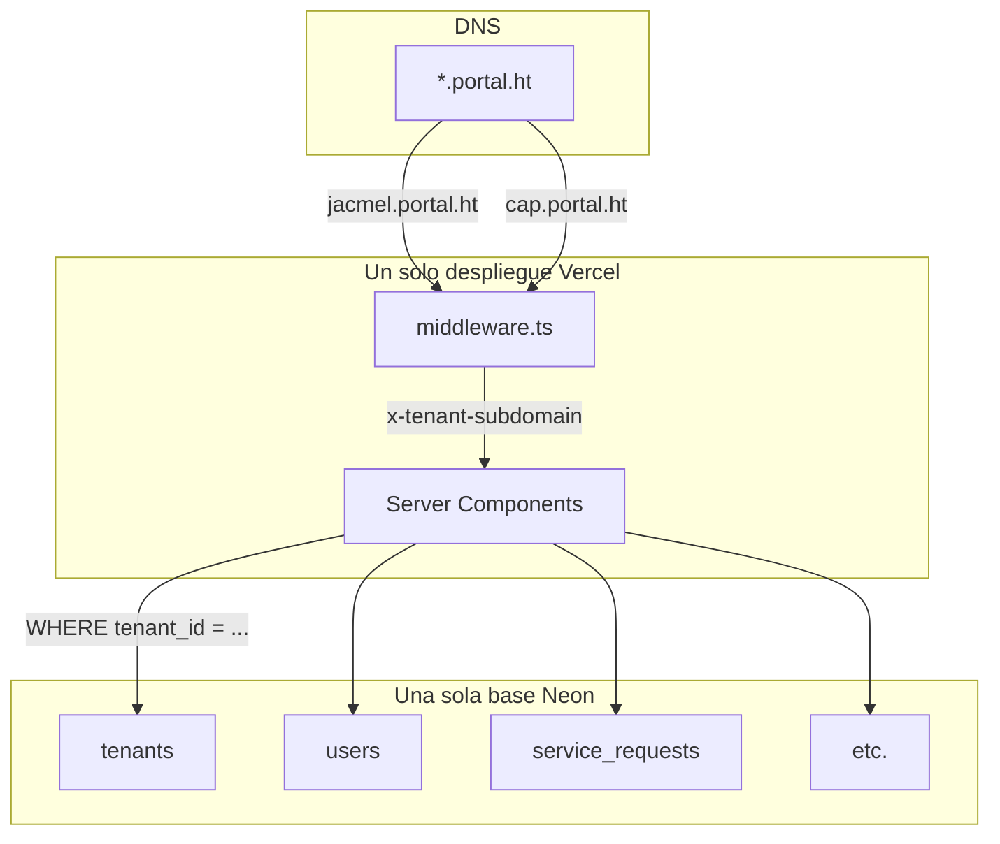
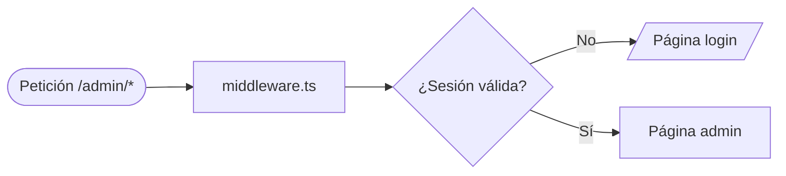

<!--
Idiomas: English (ARCHITECTURE.md) | Français (ARCHITECTURE.fr.md) | Kreyòl (ARCHITECTURE.ht.md) | Español (este archivo)
-->

**Idiomas:** [English](ARCHITECTURE.md) · [Français](ARCHITECTURE.fr.md) · [Kreyòl Ayisyen](ARCHITECTURE.ht.md) · **Español**

[← Índice de documentación](README.es.md) · [README del proyecto](../README.md) · [Glosario](GLOSSARY.es.md)

---

# Arquitectura

Vista general en una página. Léala antes de [Notas Técnicas](technical-notes.md). Para los *porqués*: [ADR](adr/README.es.md).

## Índice

- [Diagrama del sistema](#diagrama-del-sistema)
- [Diagrama del flujo de una petición](#diagrama-del-flujo-de-una-petición)
- [Estructura del código](#estructura-del-código)
- [Las seis reglas estrictas](#las-seis-reglas-estrictas)
- [Frontend vs backend](#frontend-vs-backend)
- [Flujo de datos](#flujo-de-datos)
- [Multi-tenant](#multi-tenant)
- [Internacionalización](#internacionalización)
- [Sistema de contenido](#sistema-de-contenido)
- [Autenticación y roles](#autenticación-y-roles)

---

## Diagrama del sistema



[↑ Volver arriba](#índice)

---

## Diagrama del flujo de una petición

Visita a `https://jacmel.portal.ht/services/trash`:



[↑ Volver arriba](#índice)

---

## Estructura del código

```
HaitiCityPortal/
├── src/
│   ├── middleware.ts             ← corre antes de cada petición
│   ├── auth.ts, auth.config.ts   ← NextAuth
│   ├── app/
│   │   ├── [locale]/
│   │   │   ├── (public)/         ← acceso libre
│   │   │   └── (protected)/      ← requiere sesión (admin)
│   │   ├── actions/              ← server actions
│   │   ├── api/                  ← rutas API
│   │   ├── layout.tsx
│   │   ├── error.tsx
│   │   └── not-found.tsx         ← 404 (usa next/link, ver ADR)
│   ├── components/
│   ├── content/                  ← MDX
│   ├── db/                       ← Drizzle, seed
│   ├── features/
│   ├── hooks/
│   ├── i18n/                     ← next-intl
│   ├── lib/
│   └── utils/
├── messages/                     ← strings UI (4 locales)
├── docs/
├── drizzle/                      ← migraciones
├── tests/e2e/                    ← Playwright
├── public/
├── .github/workflows/            ← CI
└── …
```

[↑ Volver arriba](#índice)

---

## Las seis reglas estrictas

No negociables.

| # | Regla | Por qué |
|---|---|---|
| 1 | Toda tabla de entidad tiene `tenant_id`. Toda consulta filtra por él. | Aislamiento entre tenants. |
| 2 | Todas las PKs son `uuid().defaultRandom()`. | Generación offline sin colisiones. [ADR-0002](adr/0002-uuid-primary-keys.es.md). |
| 3 | Sin strings UI hardcodeados. UI en `messages/*.json`; prosa en `src/content/*.mdx`. | Corrección multilingüe. |
| 4 | Todas las páginas bajo `src/app/[locale]/`. | Prefijo de locale obligatorio. |
| 5 | `x-tenant-subdomain` la pone solo el middleware — nunca confiar desde el cliente. | Evita suplantación de tenant. |
| 6 | `Link`, `redirect`, `useRouter` desde `@/i18n/navigation` (excepto `not-found.tsx`). | Prefijos automáticos, tipos seguros. |

También en [`copilot-instructions.md`](../copilot-instructions.md).

[↑ Volver arriba](#índice)

---

## Frontend vs backend

En Next.js, frontend y backend **comparten la misma base de código**, pero corren en lugares distintos.

| Código | Corre en | Función |
|---|---|---|
| `src/components/**/*.tsx` (sin `"use client"`) | Servidor | Componentes renderizados en server |
| `src/components/**/*.tsx` (con `"use client"`) | Navegador | Componentes interactivos |
| `src/app/[locale]/**/page.tsx` (default) | Servidor | Páginas (Server Components) |
| `src/app/actions/**/*.ts` | Servidor | Envíos de formulario |
| `src/app/api/**/route.ts` | Servidor | Endpoints API |
| `src/middleware.ts` | Edge | Locale + tenant + auth |
| `src/db/**` | Solo servidor | Drizzle |
| `src/lib/**` | Servidor (mayormente) | Helpers |

[↑ Volver arriba](#índice)

---

## Flujo de datos



[↑ Volver arriba](#índice)

---

## Multi-tenant



Una app. Una base. Muchas comunas. Datos separados lógicamente por `tenant_id`. [ADR-0001](adr/0001-multi-tenant-via-subdomain.es.md).

[↑ Volver arriba](#índice)

---

## Internacionalización

Tres capas:

| Capa | Ubicación | Ejemplo |
|---|---|---|
| Etiquetas UI | `messages/{locale}.json` | "Enviar", "Pagar" |
| Prosa | `src/content/**/*.{locale}.mdx` | Descripciones de servicios |
| Dinámico | Columnas JSONB `{en,fr,ht,es}` | Nombres editables |

URLs con prefijo. Default: `ht`. Fallback silencioso al inglés.

[↑ Volver arriba](#índice)

---

## Sistema de contenido

`src/lib/content.tsx`:

| Función | Uso |
|---|---|
| `loadContent(slug, locale)` | Cualquier MDX |
| `loadNewsItems(locale, limit)` | Últimas N noticias (home) |
| `loadAllNewsItems(locale)` | Índice de noticias |
| `loadNewsItem(slug, locale)` | Detalle de noticia |
| `getNewsSlugs()` | `generateStaticParams` |
| `getNewsCount()` | Mostrar "Ver todas" condicionalmente |
| `MarkdownRenderer` | Render Markdown estilizado |

Memoización `React.cache` por `(slug, locale)`. [ADR-0003](adr/0003-mdx-content-vs-database.es.md).

[↑ Volver arriba](#índice)

---

## Autenticación y roles

NextAuth v5 beta. `src/auth.config.ts` (Edge) + `src/auth.ts` (con adaptador Drizzle).

Tres roles: `user`, `admin`, `superadmin`. Las rutas que contienen `/admin` están protegidas por el middleware.



Chequeo por rol en Server Components / Server Actions vía `session.user.role`.

[↑ Volver arriba](#índice)

---

[← Índice de documentación](README.es.md) · [Glosario](GLOSSARY.es.md) · [ADR →](adr/README.es.md)
