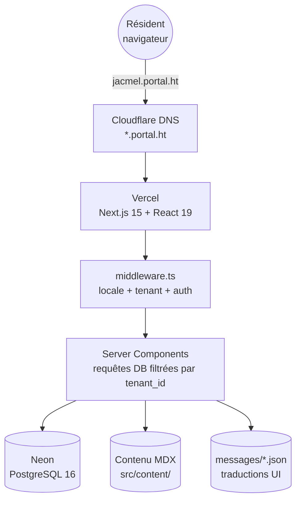
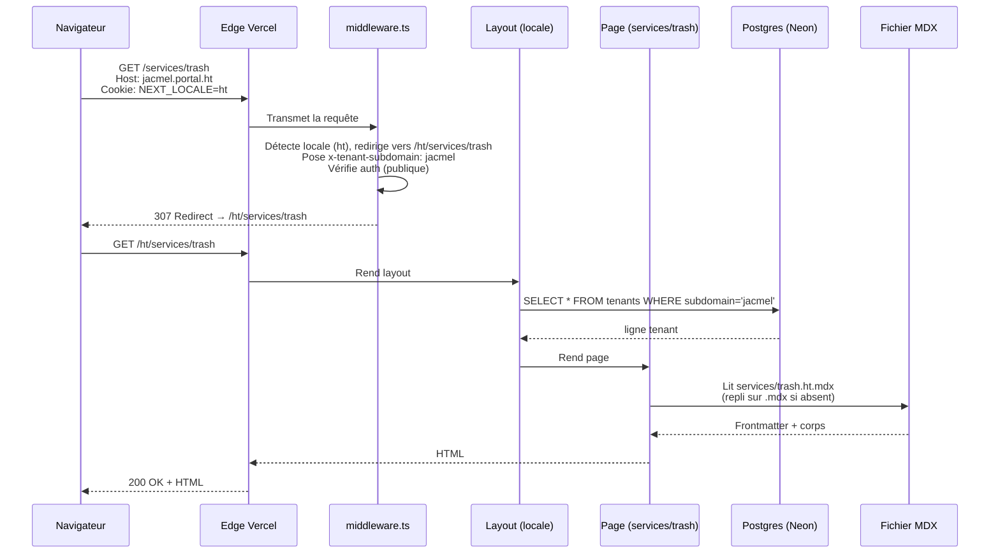
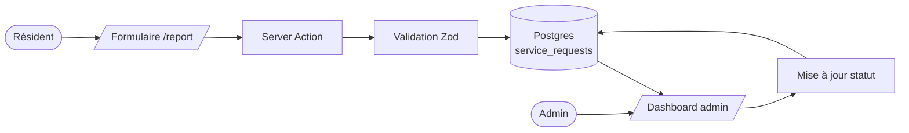
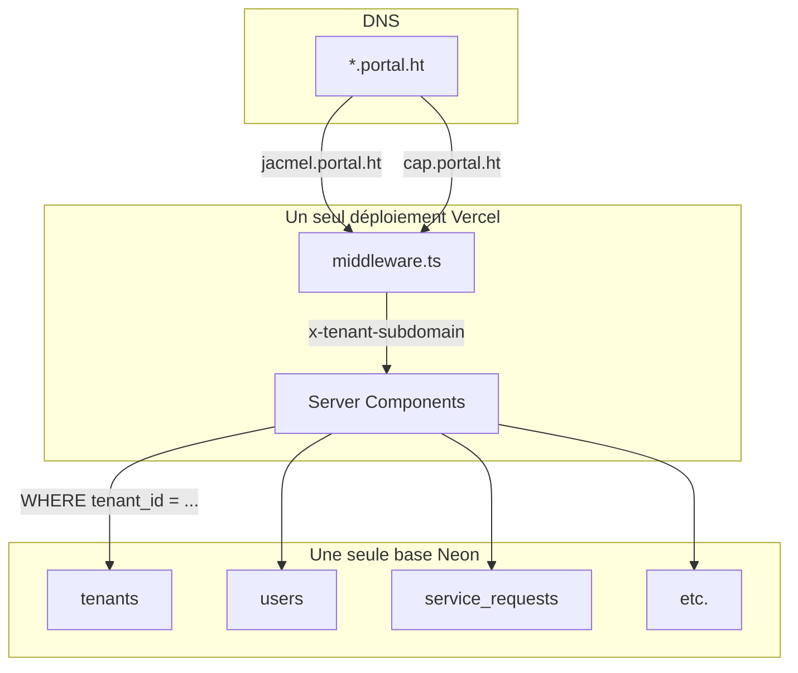
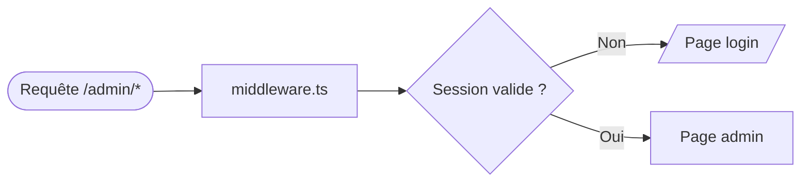

<!--
Langues : English (ARCHITECTURE.md) | Français (ce fichier) | Kreyòl (ARCHITECTURE.ht.md) | Español (ARCHITECTURE.es.md)
-->

**Langues :** [English](ARCHITECTURE.md) · **Français** · [Kreyòl Ayisyen](ARCHITECTURE.ht.md) · [Español](ARCHITECTURE.es.md)

[← Index de la documentation](README.fr.md) · [README du projet](../README.md) · [Glossaire](GLOSSARY.fr.md)

---

# Architecture

Vue d'ensemble en une page. À lire avant [Notes techniques](technical-notes.md). Pour le *pourquoi*, voir [ADR](adr/README.fr.md).

## Sommaire

- [Diagramme système](#diagramme-système)
- [Diagramme du flux d'une requête](#diagramme-du-flux-dune-requête)
- [Organisation du code](#organisation-du-code)
- [Les six règles strictes](#les-six-règles-strictes)
- [Frontend vs backend](#frontend-vs-backend)
- [Flux de données](#flux-de-données)
- [Multi-tenant](#multi-tenant)
- [Internationalisation](#internationalisation)
- [Système de contenu](#système-de-contenu)
- [Authentification et rôles](#authentification-et-rôles)

---

## Diagramme système



[↑ Retour en haut](#sommaire)

---

## Diagramme du flux d'une requête

Visite de `https://jacmel.portal.ht/services/trash` :



[↑ Retour en haut](#sommaire)

---

## Organisation du code

```
HaitiCityPortal/
├── src/
│   ├── middleware.ts             ← s'exécute avant chaque requête
│   ├── auth.ts, auth.config.ts   ← NextAuth
│   ├── app/
│   │   ├── [locale]/
│   │   │   ├── (public)/         ← accès libre
│   │   │   └── (protected)/      ← session requise (admin)
│   │   ├── actions/              ← server actions
│   │   ├── api/                  ← routes API
│   │   ├── layout.tsx            ← layout racine
│   │   ├── error.tsx             ← boundary d'erreur global
│   │   └── not-found.tsx         ← 404 (utilise next/link, voir ADR)
│   ├── components/               ← UI réutilisable
│   ├── content/                  ← contenu MDX
│   ├── db/                       ← schéma Drizzle, client, seeds
│   ├── features/                 ← composants groupés par feature
│   ├── hooks/                    ← hooks React
│   ├── i18n/                     ← next-intl
│   ├── lib/                      ← utilitaires
│   └── utils/                    ← validateurs
├── messages/                     ← chaînes UI (4 locales)
├── docs/
├── drizzle/                      ← migrations générées
├── tests/e2e/                    ← Playwright
├── public/
├── .github/workflows/            ← CI
└── …
```

[↑ Retour en haut](#sommaire)

---

## Les six règles strictes

Non négociables.

| # | Règle | Pourquoi |
|---|---|---|
| 1 | Chaque table d'entité a `tenant_id`. Chaque requête filtre dessus. | Isolation entre tenants. |
| 2 | Toutes les PKs sont `uuid().defaultRandom()`. | Génération hors-ligne sans collision. [ADR-0002](adr/0002-uuid-primary-keys.fr.md). |
| 3 | Aucune chaîne UI codée en dur. UI dans `messages/*.json` ; prose dans `src/content/*.mdx`. | Correction multilingue. |
| 4 | Toutes les pages sous `src/app/[locale]/`. | Préfixe locale obligatoire. |
| 5 | `x-tenant-subdomain` est posé par le middleware uniquement — jamais cru depuis le client. | Empêche l'usurpation de tenant. |
| 6 | `Link`, `redirect`, `useRouter` depuis `@/i18n/navigation` (sauf `not-found.tsx`). | Préfixes automatiques, types sûrs. |

Aussi documentées dans [`copilot-instructions.md`](../copilot-instructions.md).

[↑ Retour en haut](#sommaire)

---

## Frontend vs backend

Sous Next.js, le frontend et le backend **partagent le même code**, mais s'exécutent à des endroits différents.

| Code | S'exécute sur | Rôle |
|---|---|---|
| `src/components/**/*.tsx` (sans `"use client"`) | Serveur | Composants rendus côté serveur |
| `src/components/**/*.tsx` (avec `"use client"`) | Navigateur | Composants interactifs (cartes, formulaires) |
| `src/app/[locale]/**/page.tsx` (par défaut) | Serveur | Pages (Server Components) |
| `src/app/actions/**/*.ts` | Serveur | Soumissions de formulaires |
| `src/app/api/**/route.ts` | Serveur | Endpoints API |
| `src/middleware.ts` | Edge | Locale + tenant + auth |
| `src/db/**` | Serveur uniquement | Drizzle |
| `src/lib/**` | Serveur (essentiellement) | Helpers |

[↑ Retour en haut](#sommaire)

---

## Flux de données



[↑ Retour en haut](#sommaire)

---

## Multi-tenant



Une application. Une base. Plusieurs communes. Données séparées logiquement par `tenant_id`. Voir [ADR-0001](adr/0001-multi-tenant-via-subdomain.fr.md).

[↑ Retour en haut](#sommaire)

---

## Internationalisation

Trois couches :

| Couche | Emplacement | Exemple |
|---|---|---|
| Étiquettes UI | `messages/{locale}.json` | « Soumettre », « Payer » |
| Prose | `src/content/**/*.{locale}.mdx` | Description de services, articles |
| Dynamique | Colonnes JSONB `{en,fr,ht,es}` | Noms de services modifiables |

URLs préfixées. Locale par défaut : `ht`. Repli silencieux sur l'anglais.

[↑ Retour en haut](#sommaire)

---

## Système de contenu

`src/lib/content.tsx` :

| Fonction | Usage |
|---|---|
| `loadContent(slug, locale)` | Tout fichier MDX |
| `loadNewsItems(locale, limit)` | N derniers articles (accueil) |
| `loadAllNewsItems(locale)` | Index actualités |
| `loadNewsItem(slug, locale)` | Détail article |
| `getNewsSlugs()` | `generateStaticParams` |
| `getNewsCount()` | Lien « Voir tout » conditionnel |
| `MarkdownRenderer` | Rendu Markdown stylé |

Mémoïsation `React.cache` par `(slug, locale)`. Voir [ADR-0003](adr/0003-mdx-content-vs-database.fr.md).

[↑ Retour en haut](#sommaire)

---

## Authentification et rôles

NextAuth v5 beta. `src/auth.config.ts` (Edge) + `src/auth.ts` (avec adaptateur Drizzle).

Trois rôles : `user`, `admin`, `superadmin`. Les chemins contenant `/admin` sont protégés par le middleware.



Vérifications par rôle dans Server Components / Server Actions via `session.user.role`.

[↑ Retour en haut](#sommaire)

---

[← Index de la documentation](README.fr.md) · [Glossaire](GLOSSARY.fr.md) · [ADR →](adr/README.fr.md)
