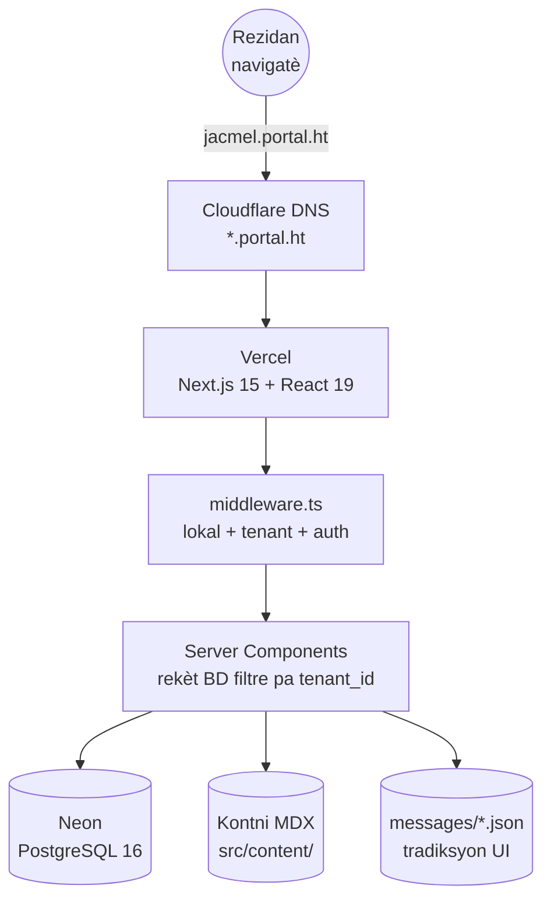
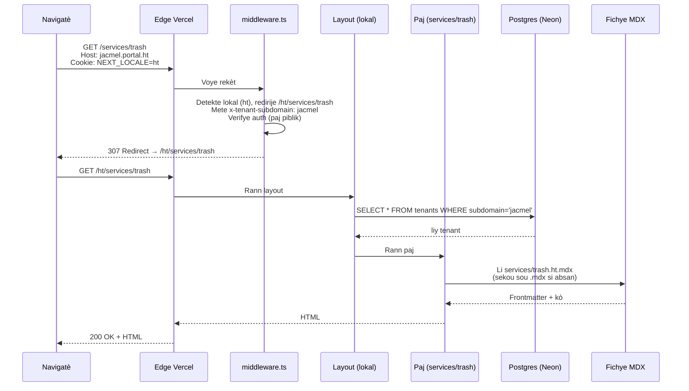
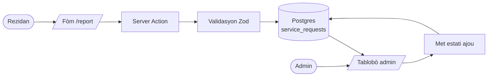
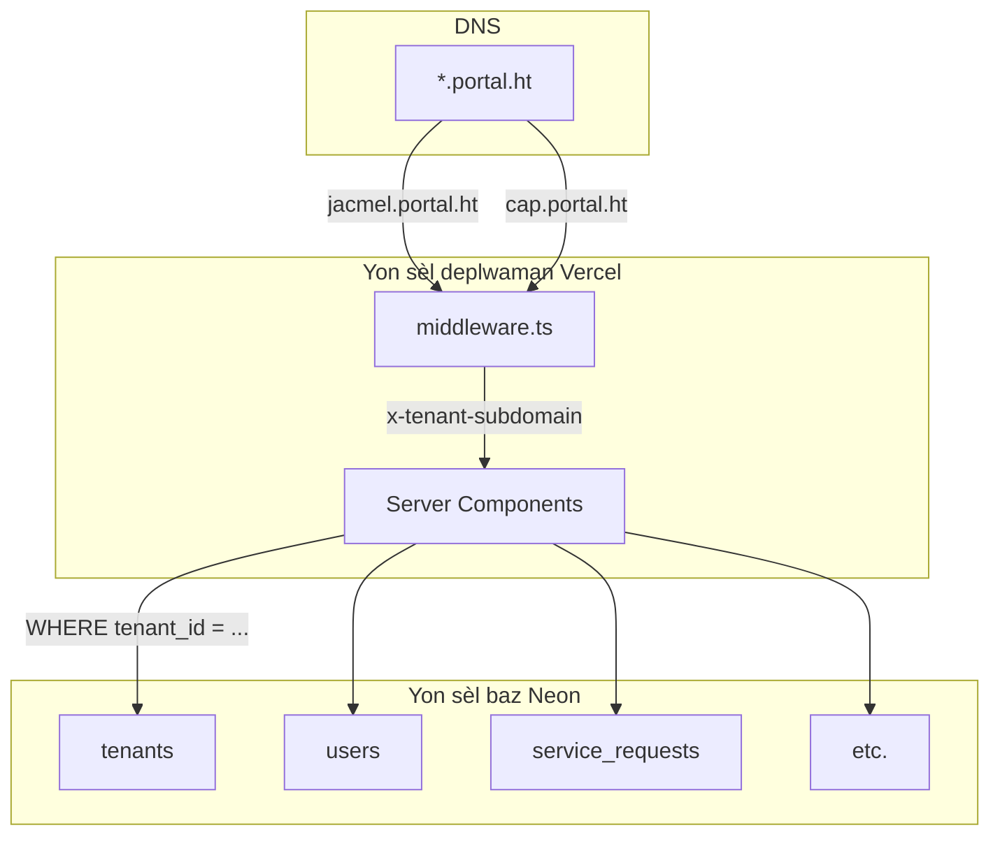
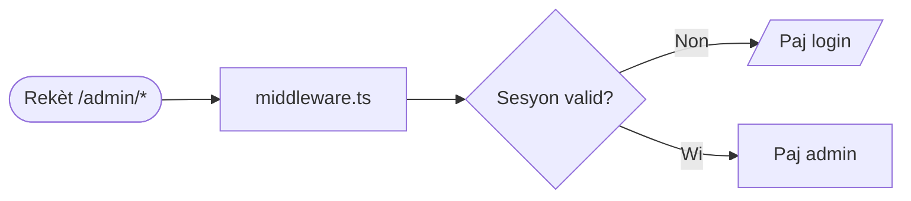

<!--
Lang yo: English (ARCHITECTURE.md) | Français (ARCHITECTURE.fr.md) | Kreyòl (fichye sa a) | Español (ARCHITECTURE.es.md)
-->

**Lang yo:** [English](ARCHITECTURE.md) · [Français](ARCHITECTURE.fr.md) · **Kreyòl Ayisyen** · [Español](ARCHITECTURE.es.md)

[← Endèks dokimantasyon](README.ht.md) · [README pwojè a](../README.md) · [Glosè](GLOSSARY.ht.md)

---

# Achitekti

Apèsi achitekti sou yon paj. Li sa anvan [Nòt Teknik](technical-notes.md). Pou poukisa: [ADR](adr/README.ht.md).

## Tablo Kontni

- [Dyagram sistèm](#dyagram-sistèm)
- [Dyagram flo yon rekèt](#dyagram-flo-yon-rekèt)
- [Estrikti kòd la](#estrikti-kòd-la)
- [Sis règ strik yo](#sis-règ-strik-yo)
- [Frontend vs backend](#frontend-vs-backend)
- [Flo done](#flo-done)
- [Milti-tenant](#milti-tenant)
- [Entènasyonalizasyon](#entènasyonalizasyon)
- [Sistèm kontni](#sistèm-kontni)
- [Otantifikasyon ak wòl](#otantifikasyon-ak-wòl)

---

## Dyagram sistèm



[↑ Retounen anwo](#tablo-kontni)

---

## Dyagram flo yon rekèt

Vizit `https://jacmel.portal.ht/services/trash`:



[↑ Retounen anwo](#tablo-kontni)

---

## Estrikti kòd la

```
HaitiCityPortal/
├── src/
│   ├── middleware.ts             ← mache anvan chak rekèt
│   ├── auth.ts, auth.config.ts   ← NextAuth
│   ├── app/
│   │   ├── [locale]/
│   │   │   ├── (public)/         ← aksè lib
│   │   │   └── (protected)/      ← bezwen sesyon (admin)
│   │   ├── actions/              ← server actions
│   │   ├── api/                  ← woutin API
│   │   ├── layout.tsx
│   │   ├── error.tsx
│   │   └── not-found.tsx         ← 404 (itilize next/link, wè ADR)
│   ├── components/
│   ├── content/                  ← MDX
│   ├── db/                       ← Drizzle, seed
│   ├── features/
│   ├── hooks/
│   ├── i18n/                     ← next-intl
│   ├── lib/
│   └── utils/
├── messages/                     ← chèn UI (4 lokal)
├── docs/
├── drizzle/                      ← migrasyon
├── tests/e2e/                    ← Playwright
├── public/
├── .github/workflows/            ← CI
└── …
```

[↑ Retounen anwo](#tablo-kontni)

---

## Sis règ strik yo

Pa negosye.

| # | Règ | Poukisa |
|---|---|---|
| 1 | Chak tab antite gen `tenant_id`. Chak rekèt filtre dessus. | Izolasyon ant tenant. |
| 2 | Tout PK se `uuid().defaultRandom()`. | Jenerasyon ofliy san kolizyon. [ADR-0002](adr/0002-uuid-primary-keys.ht.md). |
| 3 | Pa gen chèn UI ki ekri an dur. UI nan `messages/*.json` ; prose nan `src/content/*.mdx`. | Korèksyon multilang. |
| 4 | Tout paj anba `src/app/[locale]/`. | Prefiks lokal obligatwa. |
| 5 | `x-tenant-subdomain` mete pa middleware sèlman — pa janm fè konfyans li sou kliyan. | Anpeche pretansyon tenant. |
| 6 | `Link`, `redirect`, `useRouter` soti nan `@/i18n/navigation` (sof `not-found.tsx`). | Prefiks otomatik, tip an sekirite. |

Tou nan [`copilot-instructions.md`](../copilot-instructions.md).

[↑ Retounen anwo](#tablo-kontni)

---

## Frontend vs backend

Anba Next.js, frontend ak backend **pataje menm kòd la**, men yo mache nan kote diferan.

| Kòd | Mache sou | Wòl |
|---|---|---|
| `src/components/**/*.tsx` (san `"use client"`) | Sèvè | Konpozan rann sèvè |
| `src/components/**/*.tsx` (ak `"use client"`) | Navigatè | Konpozan entèraktif |
| `src/app/[locale]/**/page.tsx` (default) | Sèvè | Paj (Server Components) |
| `src/app/actions/**/*.ts` | Sèvè | Soumisyon fòm |
| `src/app/api/**/route.ts` | Sèvè | Pwen API |
| `src/middleware.ts` | Edge | Lokal + tenant + auth |
| `src/db/**` | Sèvè sèlman | Drizzle |
| `src/lib/**` | Sèvè (sitou) | Helpers |

[↑ Retounen anwo](#tablo-kontni)

---

## Flo done



[↑ Retounen anwo](#tablo-kontni)

---

## Milti-tenant



Yon aplikasyon. Yon baz. Plizyè komin. Done separe lojikman pa `tenant_id`. [ADR-0001](adr/0001-multi-tenant-via-subdomain.ht.md).

[↑ Retounen anwo](#tablo-kontni)

---

## Entènasyonalizasyon

Twa kouch:

| Kouch | Kote | Egzanp |
|---|---|---|
| Etikèt UI | `messages/{locale}.json` | « Soumèt », « Peye » |
| Prose | `src/content/**/*.{locale}.mdx` | Deskripsyon sèvis, atik |
| Dinamik | Kolòn JSONB `{en,fr,ht,es}` | Non sèvis editab |

URL prefiks. Default: `ht`. Sekou silansye sou anglè.

[↑ Retounen anwo](#tablo-kontni)

---

## Sistèm kontni

`src/lib/content.tsx`:

| Fonksyon | Itilizasyon |
|---|---|
| `loadContent(slug, locale)` | Nenpòt fichye MDX |
| `loadNewsItems(locale, limit)` | N dènye atik (akèy) |
| `loadAllNewsItems(locale)` | Endèks nouvèl |
| `loadNewsItem(slug, locale)` | Detay atik |
| `getNewsSlugs()` | `generateStaticParams` |
| `getNewsCount()` | Lyen « Wè Tout » kondisyonèl |
| `MarkdownRenderer` | Rann Markdown style |

Memoizasyon `React.cache` pa `(slug, locale)`. [ADR-0003](adr/0003-mdx-content-vs-database.ht.md).

[↑ Retounen anwo](#tablo-kontni)

---

## Otantifikasyon ak wòl

NextAuth v5 beta. `src/auth.config.ts` (Edge) + `src/auth.ts` (ak adaptè Drizzle).

Twa wòl: `user`, `admin`, `superadmin`. Chemen ki gen `/admin` pwoteje pa middleware.



Verifikasyon pa wòl nan Server Components / Server Actions atravè `session.user.role`.

[↑ Retounen anwo](#tablo-kontni)

---

[← Endèks dokimantasyon](README.ht.md) · [Glosè](GLOSSARY.ht.md) · [ADR →](adr/README.ht.md)
