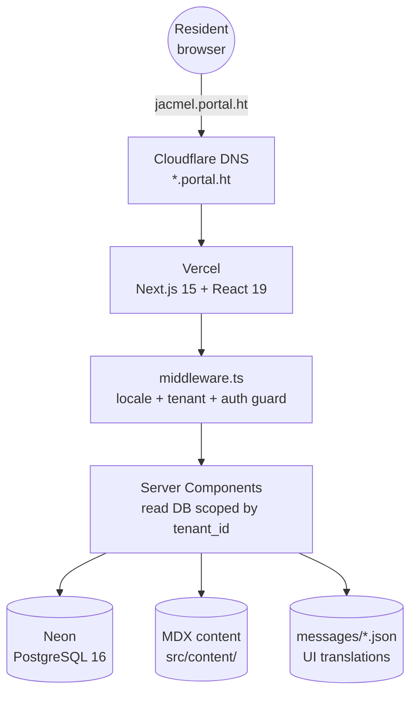
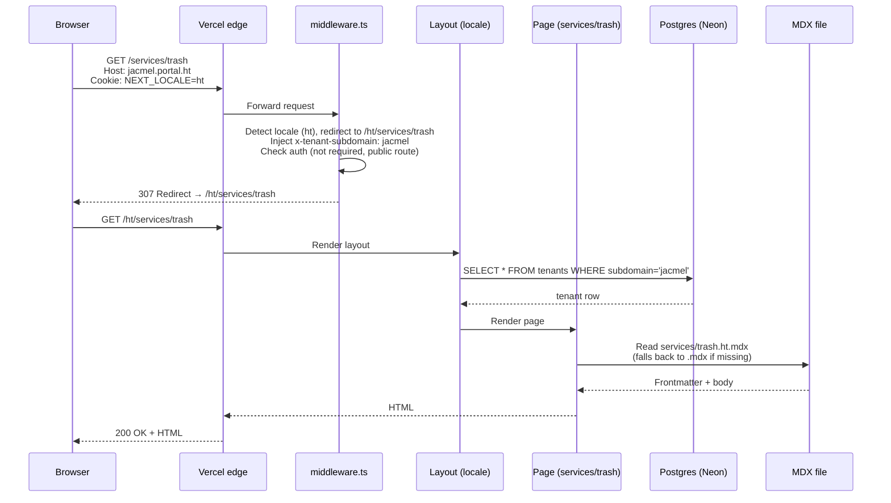
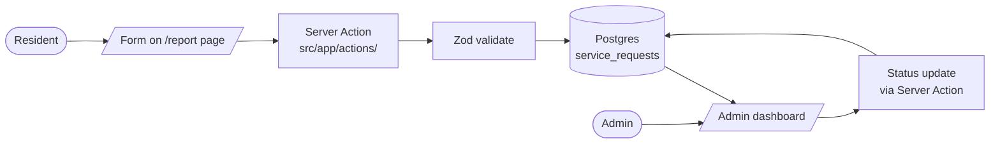
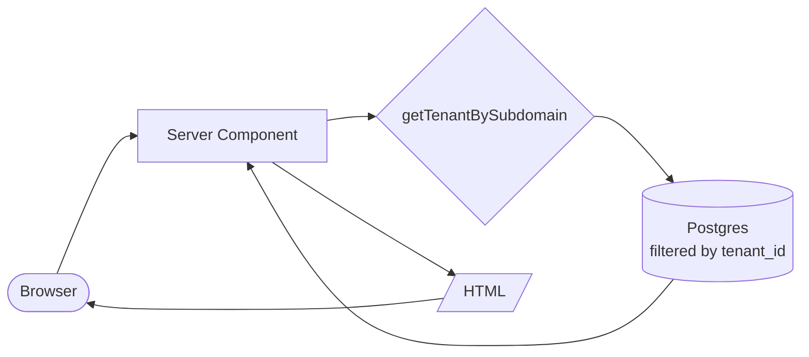
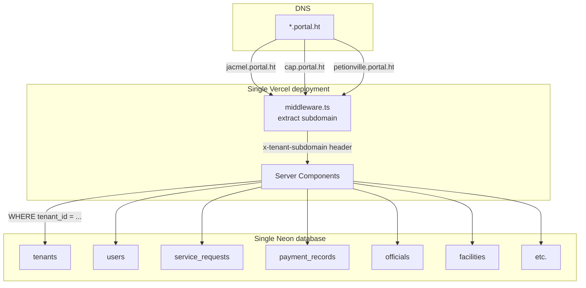
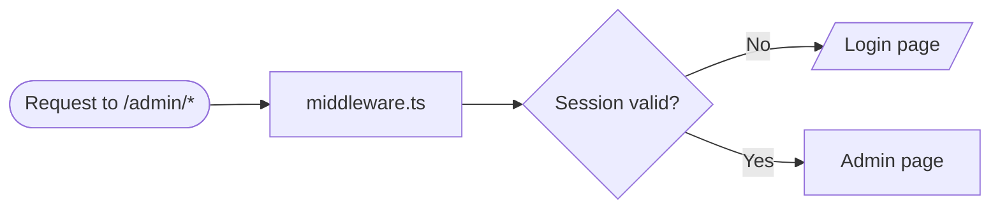

<!--
Languages: English (this file) | Français (ARCHITECTURE.fr.md) | Kreyòl (ARCHITECTURE.ht.md) | Español (ARCHITECTURE.es.md)
-->

**Languages:** **English** · [Français](ARCHITECTURE.fr.md) · [Kreyòl Ayisyen](ARCHITECTURE.ht.md) · [Español](ARCHITECTURE.es.md)

[← Docs index](README.md) · [Project README](../README.md) · [Glossary](GLOSSARY.md)

---

# Architecture

A one-page architecture overview. Read this before diving into [Technical Notes](technical-notes.md). For the *why* behind each decision, see [Architecture Decision Records](adr/README.md).

## Table of Contents

- [System diagram](#system-diagram)
- [Request flow diagram](#request-flow-diagram)
- [Codebase layout](#codebase-layout)
- [The six hard rules](#the-six-hard-rules)
- [Frontend vs backend](#frontend-vs-backend)
- [Data flow](#data-flow)
- [Multi-tenancy](#multi-tenancy)
- [Internationalization](#internationalization)
- [Content system](#content-system)
- [Authentication and roles](#authentication-and-roles)

---

## System diagram



[↑ Back to top](#table-of-contents)

---

## Request flow diagram

What happens when a resident visits `https://jacmel.portal.ht/services/trash`:



[↑ Back to top](#table-of-contents)

---

## Codebase layout

```
HaitiCityPortal/
├── src/
│   ├── middleware.ts             ← runs before every request: locale, tenant, auth
│   ├── auth.ts, auth.config.ts   ← NextAuth setup
│   ├── app/
│   │   ├── [locale]/
│   │   │   ├── (public)/         ← anyone can visit
│   │   │   └── (protected)/      ← session required (admin)
│   │   ├── actions/              ← server actions (form submissions)
│   │   ├── api/                  ← API routes (/health, /events/ics, etc.)
│   │   ├── layout.tsx            ← root layout
│   │   ├── error.tsx             ← global error boundary
│   │   └── not-found.tsx         ← 404 page (uses next/link, see ADR-0006)
│   ├── components/               ← reusable UI: nav, forms, maps, payments…
│   ├── content/                  ← MDX prose content (services, news, legal)
│   ├── db/
│   │   ├── schema.ts             ← Drizzle schema (source of truth)
│   │   ├── index.ts              ← Drizzle client
│   │   ├── seed.ts               ← demo seeder (localhost)
│   │   └── seed.production.ts    ← production seeder (env-vars driven)
│   ├── features/                 ← feature-grouped components (auth, incidents, reports)
│   ├── hooks/                    ← React hooks
│   ├── i18n/                     ← next-intl routing/navigation/request
│   ├── lib/                      ← utilities (tenants, content, cn helper)
│   └── utils/                    ← input validators
├── messages/
│   ├── en.json, fr.json, ht.json, es.json  ← UI strings only
├── docs/
├── drizzle/                      ← generated migrations
├── tests/e2e/                    ← Playwright smoke tests
├── public/                       ← static files served as-is
├── .github/workflows/            ← CI: lint, typecheck, build, db-check, e2e
├── package.json
├── next.config.ts
├── drizzle.config.ts
├── playwright.config.ts
└── tsconfig.json
```

[↑ Back to top](#table-of-contents)

---

## The six hard rules

These rules are non-negotiable. Violating them creates security, correctness, or i18n bugs.

| # | Rule | Why |
|---|---|---|
| 1 | Every entity table has `tenant_id`. Every query filters by it. | Cross-tenant data isolation. |
| 2 | All primary keys are `uuid().defaultRandom()`. | Offline ID generation, no collisions. See [ADR-0002](adr/0002-uuid-primary-keys.md). |
| 3 | No hardcoded user-visible strings. UI in `messages/*.json`; prose in `src/content/*.mdx`. | Multilingual correctness; translators don't need to read code. |
| 4 | All pages live under `src/app/[locale]/`. | Locale prefix is mandatory in URLs. |
| 5 | `x-tenant-subdomain` is set by middleware only — never trust it from client requests. | Prevents tenant impersonation. |
| 6 | Import `Link`, `redirect`, `useRouter` from `@/i18n/navigation`, NOT from `next/link`/`next/navigation`. (Exception: `src/app/not-found.tsx`.) | Locale prefixes are added automatically; type-safe routes. |

These are also documented in [`copilot-instructions.md`](../copilot-instructions.md).

[↑ Back to top](#table-of-contents)

---

## Frontend vs backend

In Next.js, frontend and backend live **in the same codebase**, but they run in different places.

| Code lives in | Runs on | What it does |
|---|---|---|
| `src/components/**/*.tsx` (no `"use client"`) | Server | Page components rendered server-side |
| `src/components/**/*.tsx` (with `"use client"`) | Browser | Interactive widgets (maps, forms with state) |
| `src/app/[locale]/**/page.tsx` (default) | Server | Pages (Server Components by default) |
| `src/app/actions/**/*.ts` | Server | Form submissions and mutations |
| `src/app/api/**/route.ts` | Server | API endpoints (JSON, GeoJSON, ICS) |
| `src/middleware.ts` | Edge runtime | Locale + tenant + auth guard |
| `src/db/**` | Server only | Database access via Drizzle |
| `src/lib/**` | Server (mostly) | Helpers (`getTenantBySubdomain`, content loaders) |

A user opening `https://jacmel.portal.ht/services/trash` in their browser actually sees:

1. HTML rendered on the server
2. A small client-side hydration bundle for interactivity
3. Anything marked `"use client"` is then run in the browser

If you have only ever seen separate `frontend/` and `backend/` folders before, this can feel unfamiliar. It's idiomatic for Next.js — see [ADR-0004](adr/README.md).

[↑ Back to top](#table-of-contents)

---

## Data flow



Reads are even simpler:



[↑ Back to top](#table-of-contents)

---

## Multi-tenancy



One application. One database. Many communes. Data is **logically separated by `tenant_id`** on every row, enforced at the application layer.

For the rationale, see [ADR-0001](adr/0001-multi-tenant-via-subdomain.md).

[↑ Back to top](#table-of-contents)

---

## Internationalization

Three layers of translatable content:

| Layer | Location | Example |
|---|---|---|
| UI labels | `messages/{locale}.json` | "Submit", "Pay now", "Hospitals" |
| Prose | `src/content/**/*.{locale}.mdx` | Service descriptions, news articles |
| Dynamic | Database JSONB columns `{en,fr,ht,es}` | Service names that admins can edit |

URLs are locale-prefixed. The default locale is `ht` (Haitian Creole). The middleware redirects bare paths (`/services` → `/ht/services`).

If a translation file is missing, the system falls back to English silently — never breaks the page.

[↑ Back to top](#table-of-contents)

---

## Content system

`src/lib/content.tsx` exposes:

| Function | Used for |
|---|---|
| `loadContent(slug, locale)` | Any MDX file (services, legal, about) |
| `loadNewsItems(locale, limit)` | Latest N news (homepage) |
| `loadAllNewsItems(locale)` | News index page |
| `loadNewsItem(slug, locale)` | News detail page |
| `getNewsSlugs()` | `generateStaticParams` for news pages |
| `getNewsCount()` | Show "View All" link conditionally |
| `MarkdownRenderer` | Render markdown body with consistent Tailwind styles |

All loaders are memoised with `React.cache` so the same `(slug, locale)` is read once per request.

For the choice to use MDX over a CMS, see [ADR-0003](adr/0003-mdx-content-vs-database.md).

[↑ Back to top](#table-of-contents)

---

## Authentication and roles

NextAuth v5 (beta). Configuration is split across two files:

- `src/auth.config.ts` — Edge-safe (no DB imports). Used by middleware.
- `src/auth.ts` — Full config with the Drizzle adapter.

Three roles: `user`, `admin`, `superadmin`. Routes containing `/admin` are protected by middleware; unauthenticated requests are redirected to `/{locale}/login?callbackUrl=...`.



Per-page role checks (e.g. only `superadmin` can edit handbook articles) are enforced inside Server Components and Server Actions by checking `session.user.role`.

[↑ Back to top](#table-of-contents)

---

[← Docs index](README.md) · [Glossary](GLOSSARY.md) · [ADRs →](adr/README.md)
